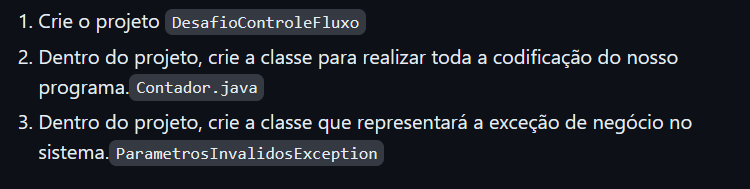

# DIO - TRILHA JAVA BÁSICO

## SOBRE:
 Exercício proposto pelo professor Gleyson Sampaio, a fim de exercitar o conteúdo apresentado no módulo de Controle de Fluxo do Santander Bootcamp 2023 - Backend Java.
 
### Atividade:
O sistema deverá receber dois parâmetros via terminal que representarão dois números inteiros, com estes dois números você deverá obter a quantidade de interações (for) 
e realizar a impressão no console (System.out.print) dos números incrementados, exemplo:

- Se você passar os números 12 e 30, logo teremos uma interação (for) com 18 ocorrências para imprimir os números, exemplo: , e assim por diante."Imprimindo o número 1"
"Imprimindo o número 2"

- Se o primeiro parâmetro for MAIOR que o segundo parâmetro, você deverá lançar a exceção customizada chamada de com a segunda mensagem: "O segundo parâmetro deve ser 
maior que o primeiro"ParametrosInvalidosException

